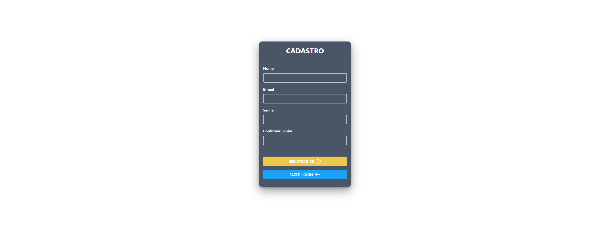
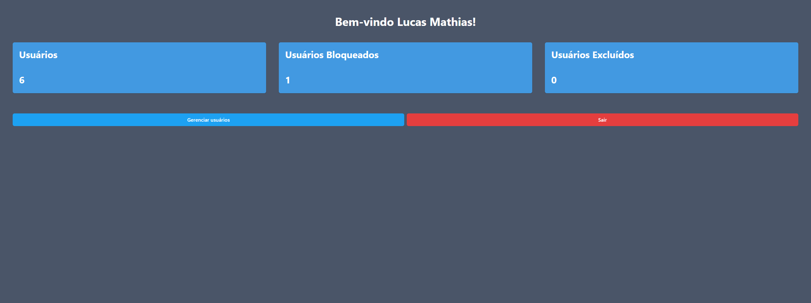
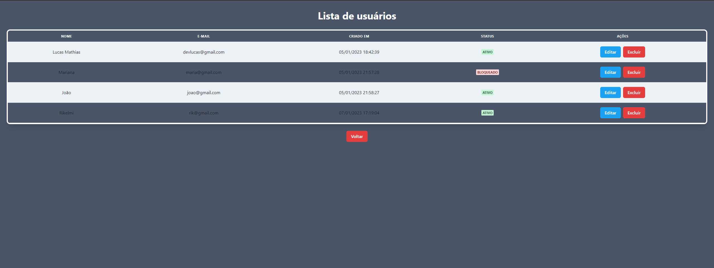

<h1 align="center">
   🔐 <a href="#"> Plataforma de Controle de usuários</a>
</h1>

 

 <a href="#sobre">Sobre</a> •
 <a href="#como-executar-o-projeto">Como Executar o Projeto</a> •
 <a href="#imagens">Imagens</a> •
 <a href="#feito-com">Feito com</a> • 
 <a href="#autor">Autor</a> 

## Sobre

Esse projeto tem como objetivo mostrar/exercictar meus conhecimentos em PHP (Laravel) e React.

A aplicação consiste em um sistema de controle e gerenciamento de usuários.

## Como Executar o Projeto ?

Antes de começar certifique-se de ter um ambiente preparado com um servidor Web, PHP (>= 8.1 + compose), NodeJs (>= 16 + NPM ou outro gerenciador de pacotes) e MySQL

Para executar o projeto, siga os seguintes passos:

 

* Abra o terminal dentro da pasta do projeto e execute <code>compose install</code> para instalar as dependências

 

* Em seguida execute o comando de instalação de dependências do Node (NPM <code>npm install</code>) 

 

* Agora dentro da pasta do projeto faça uam cópia do arquivo ".env.example" e renomeie para ".env", depois ajuste o arquivo com as credenciais do seu banco de dados MySQL

 

* Após ajustar suas credenciais e estar conectado ao seu banco de dados execute os comandos <code>php artisan migrate</code> e <code>php artisan db:seed</code>

 

* Por fim execute o script "dev" com seu gerenciador de pacotes, ou o comando "build" para compilar para produção (NPM <code>npm run dev</code> ou <code>npm run build</code>)

 

<strong>Observação:</strong> O sistema já possui um usuário administrador com email = "admin@admin.com" e senha = "admin"

## Imagens

## Recursos

- [x] Autenticação e Niveis de acesso
       
- [x] Validações no lado do cliente e servidor
       
- [x] Integração do React com o Back-end através do InertiaJs e também via API
       
- [x] Front-end construído através da biblioteca Chakra UI

## Feito com

    
    
    

    

## Autor

<a href="https://github.com/lucasMSF">
 
  
 <b>Lucas Mathias</b></a> 
  

